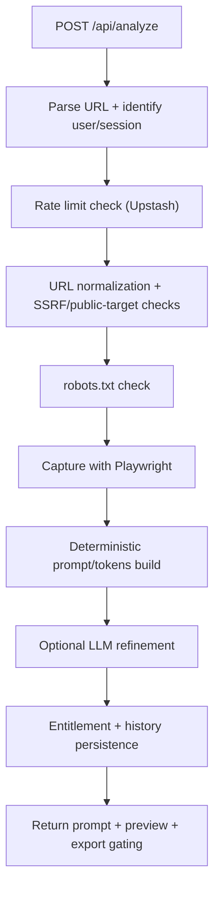
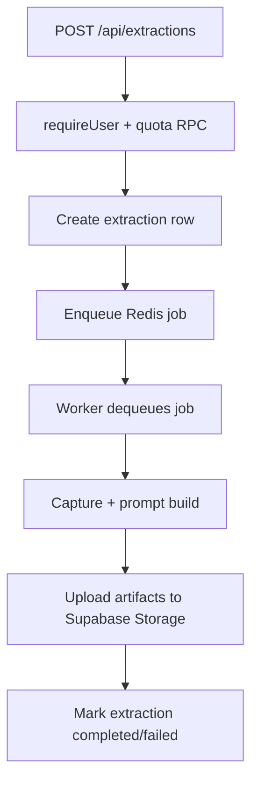

# Architecture

## Stack

- Web framework: Next.js App Router (`src/app`)
- Auth + database + storage: Supabase (`src/lib/supabase/*`, `supabase/migrations/*`)
- Rate limiting + queue: Upstash Redis (`src/lib/rate-limit.ts`, `src/lib/queue.ts`)
- Capture engine: Playwright (`src/lib/extractor/playwright-extractor.ts`)
- LLM enhancement: OpenAI-compatible chat completions (`src/lib/openai-enhance.ts`)

## Runtime Surfaces

- Primary user UI is static marketing/app pages under `public/` with root redirect in `src/app/page.tsx`.
- API layer is implemented in `src/app/api/**/route.ts`.
- Core orchestration happens in `src/lib/analyze-service.ts` for synchronous analysis.
- Legacy asynchronous extraction flow exists via `/api/extractions` + Redis queue + worker (`src/worker/index.ts`, `src/lib/worker.ts`).

## Flow 1: Synchronous Analysis (`POST /api/analyze`)

Key modules:

- Route entry: `src/app/api/analyze/route.ts`
- Orchestration: `src/lib/analyze-service.ts`
- Security checks: `src/lib/url-security.ts`, `src/lib/robots.ts`
- Capture: `src/lib/extractor/playwright-extractor.ts`
- LLM step: `src/lib/openai-enhance.ts`
- Pricing/history: `src/lib/pricing.ts`

## Flow 2: Async Extraction Queue (`/api/extractions`)

Key modules:

- Queue endpoint: `src/app/api/extractions/route.ts`
- Queue utilities: `src/lib/queue.ts`
- Worker loop: `src/worker/index.ts`
- Job processor: `src/lib/worker.ts`
- Extraction persistence: `src/lib/db.ts`

## Flow 3: Cleanup

- Triggered by `POST /api/cron/cleanup` in `src/app/api/cron/cleanup/route.ts`.
- Protected by `CRON_CLEANUP_SECRET` (header `x-cron-secret` or Bearer token).
- Deletes expired files from Supabase storage and related artifact rows via `src/lib/cleanup.ts`.

## Entitlements and Access Model

- Anonymous users: one lifetime analysis, tracked with cookie `designdna_anon_uses`.
- Logged-in users: monthly entitlements in `user_entitlements` table (`FREE`, `PRO_ACTIVE`, `PRO_CANCELED_GRACE`).
- JSON export and higher limits are gated in `src/lib/pricing.ts` and enforced by endpoints like `src/app/api/export/json/route.ts`.

## Cross-Cutting Design Choices

- Runtime input validation: `zod` in routes and env parsing.
- Fail-safe telemetry: events are non-blocking (analysis completion does not depend on telemetry writes).
- Deterministic fallback: if LLM is unavailable/invalid, deterministic prompt/token generation still returns usable output.
- Server-side trust boundaries: privileged DB/storage writes use service-role client (`src/lib/supabase/admin.ts`).
