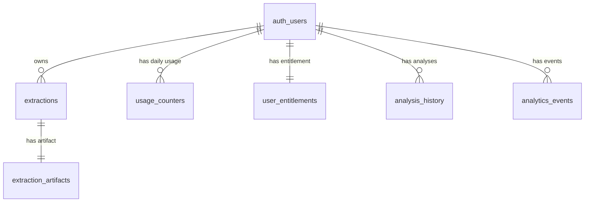

# Data Model

Database schema is managed by SQL migrations in `supabase/migrations/`.

## Migration Order

1. `20260216233000_init_designdna.sql`
2. `20260217195000_pricing_entitlements.sql`
3. `20260219120000_update_pricing_model.sql`

## Core Tables

### `extractions`

Queue-style extraction job metadata.

| Column | Type | Notes |
| --- | --- | --- |
| `id` | `uuid` | Primary key |
| `user_id` | `uuid` | FK to `auth.users`, cascade delete |
| `url` | `text` | Normalized source URL |
| `status` | `text` | `queued`, `running`, `completed`, `failed` |
| `progress_pct` | `integer` | 0-100 |
| `error_code`, `error_message`, `blocked_reason` | `text` | Failure context |
| `started_at`, `completed_at` | `timestamptz` | Job timing |
| `expires_at` | `timestamptz` | Artifact TTL cutoff |
| `created_at` | `timestamptz` | Default UTC now |

Indexes:

- `(user_id, created_at desc)`
- `(expires_at)`

### `extraction_artifacts`

Artifacts produced by async extraction jobs.

| Column | Type | Notes |
| --- | --- | --- |
| `id` | `uuid` | Primary key |
| `extraction_id` | `uuid` | Unique FK to `extractions.id` |
| `prompt_text` | `text` | Generated recreation prompt |
| `pack_json` | `jsonb` | Extracted pack payload |
| `screenshot_path`, `trace_path` | `text` | Supabase storage keys |
| `created_at` | `timestamptz` | Default UTC now |

### `usage_counters`

Daily quota counters used by `consume_user_quota`.

| Column | Type | Notes |
| --- | --- | --- |
| `user_id` | `uuid` | FK to `auth.users` |
| `date_utc` | `date` | UTC day |
| `extractions_count` | `integer` | Incremented by RPC |

Primary key: `(user_id, date_utc)`

### `rate_limit_config`

Per-plan daily cap config for the extraction queue flow.

| Column | Type | Notes |
| --- | --- | --- |
| `plan` | `text` | Primary key |
| `daily_cap` | `integer` | Positive integer |

### `user_entitlements`

Monthly entitlement state for analysis/history/export features.

| Column | Type | Notes |
| --- | --- | --- |
| `user_id` | `uuid` | Primary key, FK to `auth.users` |
| `plan` | `text` | `FREE`, `PRO_ACTIVE`, `PRO_CANCELED_GRACE` |
| `analyses_used_this_period` | `integer` | Consumed this period |
| `analyses_limit_this_period` | `integer` | Base monthly cap |
| `topup_balance` | `integer` | Additional purchased units |
| `period_start`, `period_end` | `date` | Monthly window |
| `created_at`, `updated_at` | `timestamptz` | Audit timestamps |

Notes:

- Current defaults align to Free=10, Pro=100 after migration `20260219120000_update_pricing_model.sql`.

### `analysis_history`

Persisted outputs from synchronous analysis flow.

| Column | Type | Notes |
| --- | --- | --- |
| `id` | `uuid` | Primary key |
| `user_id` | `uuid` | FK to `auth.users` |
| `source_url` | `text` | Input URL |
| `preview_payload` | `jsonb` | Lightweight UI payload |
| `export_payload` | `jsonb` | Full export JSON |
| `created_at` | `timestamptz` | Default UTC now |

Index:

- `(user_id, created_at desc)`

### `analytics_events`

Telemetry event stream.

| Column | Type | Notes |
| --- | --- | --- |
| `id` | `uuid` | Primary key |
| `user_id` | `uuid` | Nullable FK to `auth.users` |
| `event_name` | `text` | Event type |
| `event_payload` | `jsonb` | Event details |
| `created_at` | `timestamptz` | Default UTC now |

Index:

- `(event_name, created_at desc)`

## Relationships

## Security and RLS Summary

- All user-facing tables have row-level security enabled.
- Policies are user-scoped with `auth.uid() = user_id` for select/insert/update where applicable.
- `analytics_events` intentionally disallows client inserts (`with check (false)` for authenticated).
- `consume_user_quota` is `security definer`; execute granted only to authenticated and service roles.
